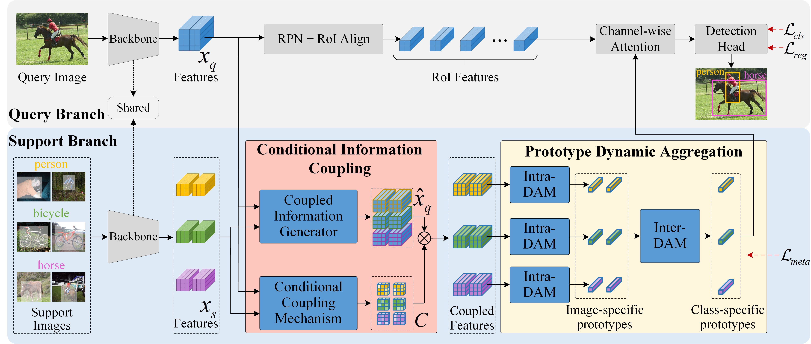

## The offical PyTorch code for paper ["Breaking Immutable: Information-Coupled Prototype Elaboration for Few-Shot Object Detection", AAAI 2023.](https://arxiv.org/pdf/2211.14782.pdf)

[](https://pypi.org/project/mmfewshot/)
[](https://pypi.org/project/mmfewshot)
[](https://mmfewshot.readthedocs.io/en/latest/)
[](https://github.com/open-mmlab/mmfewshot/actions)
[](https://codecov.io/gh/open-mmlab/mmfewshot)
[](https://github.com/open-mmlab/mmfewshot/blob/master/LICENSE)

### -------------------------------------------------------------------------------------
### 
```bash
#### News:
#### 2023.02.01: ---->The code of ICPE is available<----

```
### -------------------------------------------------------------------------------------

## Overview

<p align="middle">
  
</p>

This repo is built based on [MMFewShot](https://github.com/open-mmlab/mmfewshot).

## Installation & Dataset Preparation

The code depends on [PyTorch](https://pytorch.org/) and [MMCV](https://github.com/open-mmlab/mmcv).
Please refer to [install.md](/docs/en/install.md) for installation of MMFewShot and [data preparation](tools/data/README.md) for dataset preparation.

## Getting Started

If you are new of few shot learning, you can start with [learn the basics](docs/en/intro.md).
If you are familiar with it, check out [getting_started.md](docs/en/get_started.md) for the basic usage of mmfewshot.

**${CONFIG_FILE} of ICPE is [here](./configs/detection/icpe)**

## Citation

If you find our work and this repository useful. Please consider giving a star :star: and citation &#x1F4DA;.
